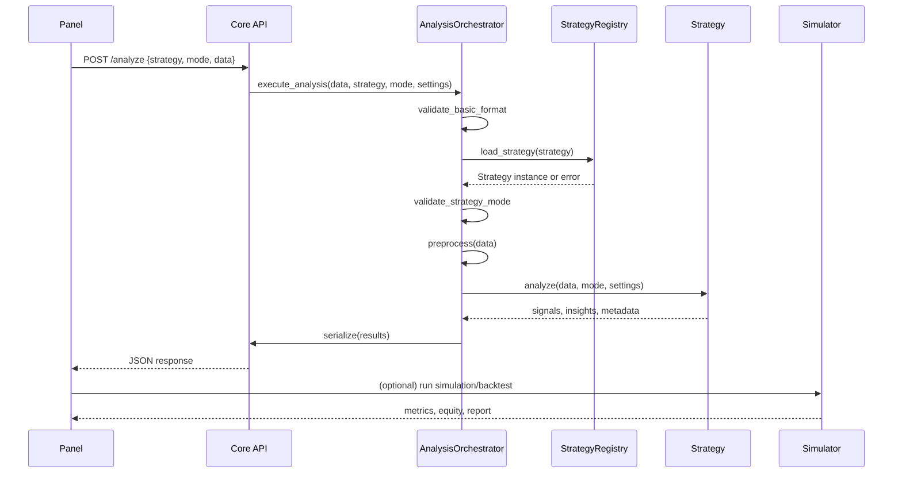
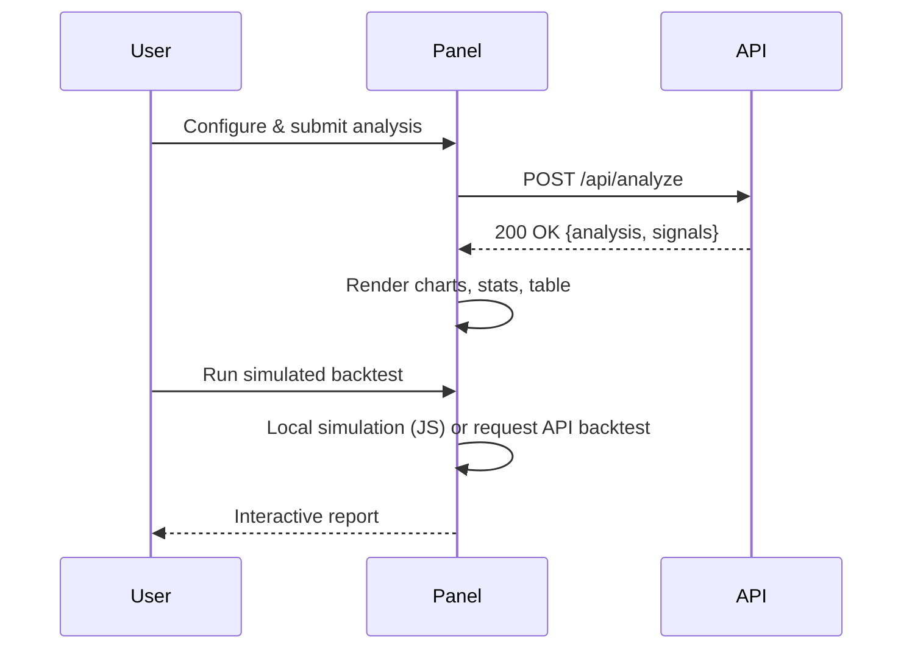

## How It Works

This document explains how the Trading Strategy Analysis Platform works end-to-end. It covers the architecture, data flow, analysis pipeline, API-panel integration, backtesting, operations, and key value propositions for investors.

### 📚 Complete Documentation

For comprehensive technical details, see the complete documentation set:

- **[INDEX.md](INDEX.md)** - Complete documentation overview and navigation
- **[analysis-flow-diagram.md](analysis-flow-diagram.md)** - Detailed analysis pipeline with Mermaid diagrams
- **[visual-flow-diagram.md](visual-flow-diagram.md)** - Visual representation of system flow
- **[simple-analysis-flow.md](simple-analysis-flow.md)** - Step-by-step analysis process breakdown
- **[data-flow-diagram.md](data-flow-diagram.md)** - Comprehensive data flow through the system
- **[method-flow-diagram.md](method-flow-diagram.md)** - Detailed method calls and variable flow
- **[strategy-analysis-deep-dive.md](strategy-analysis-deep-dive.md)** - Strategy analysis and backtesting guide
- **[docker-setup-guide.md](docker-setup-guide.md)** - Docker containerized deployment guide
- **[api-fix-summary.md](api-fix-summary.md)** - Panel API URL configuration fixes

### Executive Summary

- The platform combines a Python core engine (FastAPI) with a web analysis panel for configuring and visualizing strategies.
- It supports dynamic strategy discovery, robust validation, simulation/backtesting, and comprehensive reporting.
- Infrastructure includes InfluxDB (time-series), PostgreSQL/TimescaleDB (relational + time-series), Redis (cache/stream), Grafana & Prometheus (observability).

### System Architecture

```mermaid
graph TD
  subgraph Client
    UI[Web Panel]
  end

  subgraph API[Core Engine (FastAPI)]
    SE[Strategy Engine]
    REG[Strategy Registry]
    VAL[Validators]
    PRE[Preprocessor]
    SER[Serializer]
    SIM[Simulator/Backtester]
  end

  DBT[(TimescaleDB/PostgreSQL)]
  TSD[(InfluxDB)]
  REDIS[(Redis)]
  GRAF[Grafana]
  PROM[Prometheus]

  UI -->|HTTP/JSON| API
  SE --> REG
  SE --> VAL
  SE --> PRE
  SE --> SER
  SE --> SIM

  SE <--> TSD
  SE <--> DBT
  SE <--> REDIS

  PROM --> GRAF
  API --> PROM
  DBT --> GRAF
  TSD --> GRAF
```

### Data Flow

```mermaid
flowchart TD
  A[Data Source: Exchange/CSV] --> B[Fetcher/Loader]
  B --> C[Preprocessor: clean, types, indicators]
  C --> D[Validator: schema, ranges, gaps]
  D -->|valid| E[Strategy Engine]
  D -->|invalid| X[Error Response]
  E --> F[Strategy Registry: resolve & load]
  F --> G[Strategy.analyze(mode, settings)]
  G --> H[Signals & Analysis]
  H --> I[Serializer]
  I --> J[API Response / Storage]
  J --> K[Panel Visualization]
  H --> L[Simulator/Backtest]
  L --> M[Performance Metrics + Report]
  M --> K
```

### Analysis Pipeline (Inside Core Engine)

The orchestrator coordinates validation, preprocessing, strategy execution, and result serialization. Key modules:
- `core-engine/src/analysis/strategy_engine.py` — `AnalysisOrchestrator`, `GeneralStrategyEngine`
- `core-engine/src/core/strategy_interface.py` — `TradingStrategy` contract
- `core-engine/src/analysis/trading_signals.py` — signal generation utilities
- `core-engine/simulator/*` — trade simulation, metrics, reporting



### API ↔ Panel Integration

- Panel gathers user inputs (strategy name, mode, risk settings), validates JSON, and sends requests to the API.
- API returns structured JSON: metadata, signals, analysis, and optional performance previews.
- Panel renders chart overlays, tables, and can run local simulations for trade planning reports.



### Backtesting & Reporting

- Backtests simulate trade execution using generated signals, position sizing, fees/spread, and risk rules.
- Metrics include win rate, PnL, drawdown, profit factor, equity curve, and trade-by-trade details.
- HTML reports are generated for distribution (examples in `agent/output/`).

```mermaid
flowchart LR
  A[Signals] --> B[Trade Rules
  (entry/SL/TP, sizing)]
  B --> C[Execution Model
  (spread, slippage)]
  C --> D[Equity Curve]
  D --> E[Performance Metrics]
  E --> F[HTML/PDF Report]
```

References:
- `agent/mf01_backtest_xauusd.py` — full backtest + HTML generation flow
- `core-engine/simulator/advanced_simulation.py` — multi-strategy backtests & correlation
- `core-engine/simulator/report_generator.py` — performance metrics & reporting helpers

### Strategy Model & Extensibility

- Strategies implement the `TradingStrategy` interface to ensure consistent validation and analysis.
- Dynamic discovery via registry enables drop-in strategies under `core-engine/strategies/*`.
- External SDK interfaces allow contribution without changing the engine internals.

Key files:
- `core-engine/src/core/strategy_interface.py`
- `core-engine/MODULARITY_ARCHITECTURE.md`
- `core-engine/External_Strategist_SDK/INTERFACE_SPECIFICATION.md`

### Operations & Observability

- Docker Compose orchestrates services for dev/prod; helper scripts simplify builds and deploys.
- Health endpoints and structured logs support runtime checks.
- Prometheus scrapes metrics; Grafana provides dashboards for API latency, DB performance, and strategy KPIs.

### Security & Compliance (Highlights)

- Isolated services via containers and network policies.
- Credentials managed via environment variables and secrets (production hardening recommended).
- Audit-friendly logs and reproducible backtests support governance and investor reporting.

### Performance & Scalability

- Preprocessing and validation prevent expensive failures downstream.
- Time-series databases (InfluxDB/TimescaleDB) support efficient reads at scale.
- Stateless API scales horizontally; caching via Redis reduces repeated computations.

### Roadmap (Sample)

- Parameter optimization and hyperparameter search at scale.
- Live trading execution adapters with detailed risk controls.
- Advanced reporting with cohort analysis and scenario testing.

### Why It Matters (Investor View)

- Evidence-based strategy evaluation with transparent metrics and reports.
- Modular, extensible architecture reduces time-to-market for new strategies.
- Production-grade observability and data stores enable scaling with confidence.


