# Analysis Flow Diagram

This document provides a detailed technical flow of how the trading strategy analysis works, from user input to final results.

## Complete Analysis Flow

```mermaid
flowchart TD
    A[Panel - Analysis Form] --> B[handleAnalysisSubmit]
    B --> C{Is data JSON?}
    C -->|Yes| D[parse JSON]
    C -->|No| E[Error: Invalid format]
    D --> F[Build requestData]
    F --> G[makeAPIRequest]
    
    G --> H[Send HTTP POST]
    H --> I[API Service - /analyze]
    
    I --> J[Receive JSON payload]
    J --> K[Extract parameters]
    K --> L{Strategy exists?}
    L -->|No| M[Error: Strategy not found]
    L -->|Yes| N[load_strategy]
    
    N --> O[Strategy Registry]
    O --> P[get_strategy_manifest]
    P --> Q[load_strategy_from_manifest]
    Q --> R[Load strategy module]
    R --> S[Create strategy instance]
    
    S --> T{Batch mode?}
    T -->|Yes| U[Convert to DataFrame]
    T -->|No| V[MarketSimulator]
    
    U --> W[strategy.analyze]
    V --> X[on_candle callback]
    X --> W
    
    W --> Y[OrderBlockStrategy.analyze]
    Y --> Z[detect_order_blocks]
    
    Z --> AA[detect_moves]
    AA --> BB[MoveDetector]
    BB --> CC[Find price movements]
    
    CC --> DD[For each movement]
    DD --> EE{Movement direction?}
    EE -->|Bullish| FF[_find_bullish_order_blocks]
    EE -->|Bearish| GG[_find_bearish_order_blocks]
    
    FF --> HH[analyze_candle]
    GG --> HH
    HH --> II[CandleAnalyzer]
    II --> JJ[Calculate body_size, wick_ratio]
    
    JJ --> KK[analyze_volume_confirmation]
    KK --> LL[VolumeAnalyzer]
    LL --> MM[Calculate volume_score]
    
    MM --> NN[_calculate_order_block_strength]
    NN --> OO[Calculate strength based on:
    - price_change_score
    - consistency_score  
    - volume_score
    - body_ratio]
    
    OO --> PP[_filter_overlapping_blocks]
    PP --> QQ[Remove overlapping order blocks]
    
    QQ --> RR[Build OrderBlockResult]
    RR --> SS[Includes:
    - bullish_blocks
    - bearish_blocks
    - total_blocks
    - strong_blocks]
    
    SS --> TT[_create_success_response]
    TT --> UU[Build final response]
    UU --> VV[Return JSON Response]
    
    VV --> WW[Panel - Receive response]
    WW --> XX[updateAnalysisResults]
    XX --> YY[Display results in UI]
    YY --> ZZ[Enable operation buttons]

    style A fill:#e1f5fe
    style I fill:#f3e5f5
    style Y fill:#e8f5e8
    style ZZ fill:#fff3e0
```

## Key Variables at Each Stage

### 1. Panel Input
- `data`: OHLC data (JSON/CSV)
- `strategy_name`: Strategy identifier
- `strategy_mode`: Analysis mode (bullish/bearish/combined)
- `settings`: Custom configuration parameters

### 2. API Processing
- `payload`: Received JSON data
- `data_records`: List of market data records
- `strategy`: Strategy instance
- `df`: Processed DataFrame

### 3. Strategy Analysis
- `moves`: Detected price movements
- `bullish_blocks`: Bullish order blocks
- `bearish_blocks`: Bearish order blocks
- `strength`: Strength score for each order block

### 4. Final Output
- `OrderBlockResult`: Complete analysis results
- `analysis`: Structured analysis data
- `status`: Success/error status

## Key Files

### Frontend
- `panel/script.js`: UI management and API calls
- `panel/index.html`: Panel structure

### Backend
- `core-engine/src/services/api_service.py`: API endpoints
- `core-engine/src/analysis/strategy_engine.py`: Analysis engine
- `core-engine/src/core/strategy_registry.py`: Strategy management
- `core-engine/src/strategies/orderblock_strategy.py`: Strategy implementation

### Interface
- `core-engine/src/core/strategy_interface.py`: Strategy interface contract

## Technical Details

### Strategy Registry Flow
1. **Discovery**: Auto-scan strategy directories
2. **Validation**: Check manifest and dependencies
3. **Loading**: Dynamic module import and instantiation

### Data Processing Pipeline
1. **Validation**: Schema, data types, ranges
2. **Preprocessing**: Clean, normalize, add indicators
3. **Analysis**: Execute strategy-specific logic
4. **Serialization**: Format results for API response

### Error Handling
- Input validation errors return structured error responses
- Strategy loading failures are logged and reported
- Data processing errors include context and suggestions

## Performance Considerations

- **Caching**: Strategy instances are cached after first load
- **Validation**: Early validation prevents expensive processing failures
- **Batch Processing**: DataFrame operations optimize memory usage
- **Async Support**: Non-blocking operations for large datasets
