# نمودار جریان فرآیند آنالیز استراتژی معاملاتی

```mermaid
flowchart TD
    A[پنل - فرم آنالیز] --> B[handleAnalysisSubmit]
    B --> C{داده JSON است؟}
    C -->|بله| D[parse JSON]
    C -->|خیر| E[خطا: فرمت نامعتبر]
    D --> F[ساخت requestData]
    F --> G[makeAPIRequest]
    
    G --> H[ارسال HTTP POST]
    H --> I[API Service - /analyze]
    
    I --> J[دریافت JSON payload]
    J --> K[استخراج پارامترها]
    K --> L{استراتژی موجود است؟}
    L -->|خیر| M[خطا: استراتژی یافت نشد]
    L -->|بله| N[load_strategy]
    
    N --> O[Strategy Registry]
    O --> P[get_strategy_manifest]
    P --> Q[load_strategy_from_manifest]
    Q --> R[بارگذاری ماژول استراتژی]
    R --> S[ایجاد instance استراتژی]
    
    S --> T{حالت batch؟}
    T -->|بله| U[تبدیل به DataFrame]
    T -->|خیر| V[MarketSimulator]
    
    U --> W[strategy.analyze]
    V --> X[on_candle callback]
    X --> W
    
    W --> Y[OrderBlockStrategy.analyze]
    Y --> Z[detect_order_blocks]
    
    Z --> AA[detect_moves]
    AA --> BB[MoveDetector]
    BB --> CC[یافتن حرکت‌های قیمت]
    
    CC --> DD[برای هر حرکت]
    DD --> EE{جهت حرکت؟}
    EE -->|صعودی| FF[_find_bullish_order_blocks]
    EE -->|نزولی| GG[_find_bearish_order_blocks]
    
    FF --> HH[analyze_candle]
    GG --> HH
    HH --> II[CandleAnalyzer]
    II --> JJ[محاسبه body_size, wick_ratio]
    
    JJ --> KK[analyze_volume_confirmation]
    KK --> LL[VolumeAnalyzer]
    LL --> MM[محاسبه volume_score]
    
    MM --> NN[_calculate_order_block_strength]
    NN --> OO[محاسبه قدرت بر اساس:
    - price_change_score
    - consistency_score  
    - volume_score
    - body_ratio]
    
    OO --> PP[_filter_overlapping_blocks]
    PP --> QQ[حذف order blocks همپوشان]
    
    QQ --> RR[ساخت OrderBlockResult]
    RR --> SS[شامل:
    - bullish_blocks
    - bearish_blocks
    - total_blocks
    - strong_blocks]
    
    SS --> TT[_create_success_response]
    TT --> UU[ساخت پاسخ نهایی]
    UU --> VV[بازگشت JSON Response]
    
    VV --> WW[پنل - دریافت پاسخ]
    WW --> XX[updateAnalysisResults]
    XX --> YY[نمایش نتایج در UI]
    YY --> ZZ[فعال کردن دکمه‌های عملیات]

    style A fill:#e1f5fe
    style I fill:#f3e5f5
    style Y fill:#e8f5e8
    style ZZ fill:#fff3e0
```

## متغیرهای کلیدی در هر مرحله:

### 1. ورودی پنل
- `data`: داده‌های OHLC (JSON/CSV)
- `strategy_name`: نام استراتژی
- `strategy_mode`: حالت تحلیل
- `settings`: تنظیمات سفارشی

### 2. پردازش API
- `payload`: JSON دریافتی
- `data_records`: لیست داده‌ها
- `strategy`: instance استراتژی
- `df`: DataFrame پردازش شده

### 3. تحلیل استراتژی
- `moves`: حرکت‌های تشخیص داده شده
- `bullish_blocks`: order blocks صعودی
- `bearish_blocks`: order blocks نزولی
- `strength`: قدرت هر order block

### 4. خروجی نهایی
- `OrderBlockResult`: نتایج کامل
- `analysis`: تحلیل ساختاریافته
- `status`: وضعیت موفقیت/خطا

## فایل‌های کلیدی:

### Frontend
- `panel/script.js`: مدیریت UI و API calls
- `panel/index.html`: ساختار پنل

### Backend
- `core-engine/src/services/api_service.py`: API endpoints
- `core-engine/src/analysis/strategy_engine.py`: موتور تحلیل
- `core-engine/src/core/strategy_registry.py`: مدیریت استراتژی‌ها
- `core-engine/src/strategies/orderblock_strategy.py`: پیاده‌سازی استراتژی

### Interface
- `core-engine/src/core/strategy_interface.py`: رابط استراتژی‌ها 