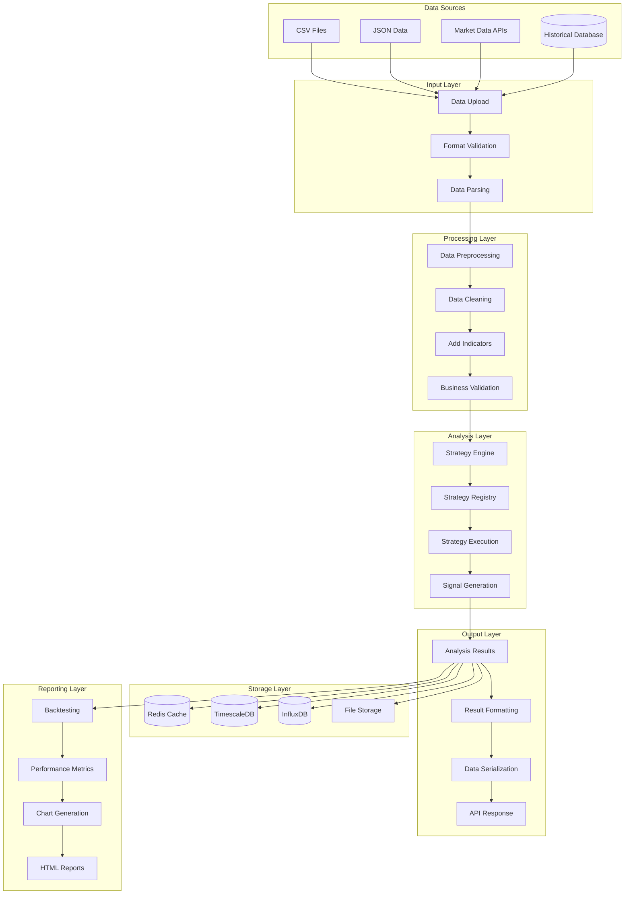
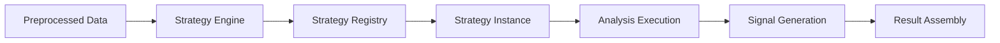

# Data Flow Diagram

This document provides a comprehensive overview of how data flows through the Trading Strategy Analysis Platform, from initial input to final results and reporting.

## Complete Data Flow Overview



## Detailed Data Flow Stages

### 1. Data Input & Validation

#### Input Sources
- **CSV Files**: Historical OHLC data from various sources
- **JSON Data**: Real-time or batch market data
- **Market APIs**: Live data feeds from exchanges
- **Historical Database**: Previously analyzed datasets

#### Validation Process
```python
def validate_input_data(data):
    # Format validation
    if not has_required_columns(data):
        return False, "Missing required columns"
    
    # Data type validation
    if not validate_data_types(data):
        return False, "Invalid data types"
    
    # Business logic validation
    if not validate_ohlc_logic(data):
        return False, "Invalid OHLC relationships"
    
    return True, "Data valid"
```

### 2. Data Preprocessing

#### Cleaning Operations
- **Missing Values**: Fill gaps using interpolation or forward fill
- **Outliers**: Remove or smooth extreme price movements
- **Duplicates**: Eliminate duplicate records
- **Time Gaps**: Identify and handle missing time periods

#### Enrichment
- **Volume Data**: Add volume if missing from source
- **Technical Indicators**: Calculate RSI, moving averages, etc.
- **Time Features**: Extract day of week, month, etc.
- **Market Structure**: Identify support/resistance levels

### 3. Strategy Analysis

#### Data Flow Through Strategy


#### Strategy Processing
1. **Data Loading**: Convert to strategy-specific format
2. **Pattern Detection**: Identify trading patterns and setups
3. **Signal Generation**: Create entry/exit signals
4. **Risk Calculation**: Determine position sizes and stop losses
5. **Result Compilation**: Package results with metadata

### 4. Data Storage & Caching

#### Storage Strategy
- **Redis Cache**: Fast access to recent results and configurations
- **TimescaleDB**: Relational storage for analysis results and metadata
- **InfluxDB**: Time-series data for market data and performance metrics
- **File Storage**: Export results and generated reports

#### Caching Layers
```python
# Multi-layer caching strategy
def get_cached_result(key):
    # L1: Redis cache (fastest)
    result = redis.get(key)
    if result:
        return result
    
    # L2: Database cache
    result = database.get(key)
    if result:
        redis.set(key, result, ttl=3600)  # Cache for 1 hour
        return result
    
    # L3: Generate new result
    result = generate_result(key)
    cache_result(key, result)
    return result
```

### 5. Result Processing & Output

#### Result Structure
```json
{
  "status": "success",
  "metadata": {
    "strategy": "orderblock",
    "mode": "bullish",
    "timestamp": "2024-01-15T10:30:00Z",
    "processing_time": "1.23s"
  },
  "analysis": {
    "signals": [...],
    "patterns": [...],
    "metrics": {...}
  },
  "data_quality": {
    "total_records": 1000,
    "valid_records": 998,
    "warnings": [...]
  }
}
```

#### Output Formats
- **JSON API**: Structured data for frontend consumption
- **CSV Export**: Tabular data for external analysis
- **HTML Reports**: Interactive visualizations and summaries
- **PDF Reports**: Professional documentation for stakeholders

## Data Quality & Validation

### Quality Checks
- **Completeness**: Required fields present and populated
- **Accuracy**: OHLC relationships and price continuity
- **Consistency**: Time intervals and data formats
- **Timeliness**: Data freshness and update frequency

### Validation Rules
```python
VALIDATION_RULES = {
    "ohlc_logic": {
        "high >= open": True,
        "high >= close": True,
        "low <= open": True,
        "low <= close": True
    },
    "price_continuity": {
        "max_jump_percent": 50.0,  # Maximum 50% price jump
        "min_price": 0.01,         # Minimum valid price
        "max_price": 1000000.0     # Maximum valid price
    },
    "time_consistency": {
        "max_gap_minutes": 60,     # Maximum 1-hour gap
        "required_columns": ["timestamp", "open", "high", "low", "close"]
    }
}
```

## Performance & Optimization

### Data Processing Optimization
- **Batch Processing**: Process multiple records simultaneously
- **Memory Management**: Efficient DataFrame operations
- **Parallel Processing**: Multi-threaded analysis where possible
- **Streaming**: Process data in chunks for large datasets

### Caching Strategy
- **Result Caching**: Cache analysis results with TTL
- **Configuration Caching**: Cache strategy parameters
- **Data Caching**: Cache frequently accessed market data
- **Query Caching**: Cache database query results

## Data Security & Privacy

### Security Measures
- **Input Sanitization**: Validate and clean all input data
- **Access Control**: Role-based access to sensitive data
- **Audit Logging**: Track all data access and modifications
- **Data Encryption**: Encrypt sensitive data at rest and in transit

### Privacy Considerations
- **Data Anonymization**: Remove personally identifiable information
- **Retention Policies**: Define data retention and deletion schedules
- **Compliance**: Ensure compliance with relevant regulations
- **Data Portability**: Allow users to export their data

## Monitoring & Observability

### Data Flow Monitoring
- **Input Volume**: Track data ingestion rates
- **Processing Times**: Monitor analysis performance
- **Error Rates**: Track validation and processing failures
- **Data Quality**: Monitor data quality metrics

### Alerting
- **Data Quality Alerts**: Notify on validation failures
- **Performance Alerts**: Alert on slow processing times
- **Error Alerts**: Notify on system errors
- **Capacity Alerts**: Alert on storage or processing limits

## Business Intelligence

### Data Analytics
- **Usage Patterns**: Analyze how users interact with the platform
- **Performance Metrics**: Track strategy performance over time
- **Market Analysis**: Identify market trends and patterns
- **User Behavior**: Understand user preferences and needs

### Reporting
- **Executive Dashboards**: High-level performance overview
- **Operational Reports**: Detailed operational metrics
- **User Reports**: Individual user performance and usage
- **Market Reports**: Market analysis and insights

## Future Enhancements

### Planned Improvements
- **Real-time Streaming**: Live data processing and analysis
- **Machine Learning**: AI-powered data quality and analysis
- **Advanced Analytics**: More sophisticated statistical analysis
- **Data Integration**: Connect to more data sources and APIs

### Research Areas
- **Alternative Data**: Social media, news, and sentiment data
- **Market Microstructure**: Order flow and market depth analysis
- **Regime Detection**: Market condition identification
- **Predictive Analytics**: Forward-looking market analysis
