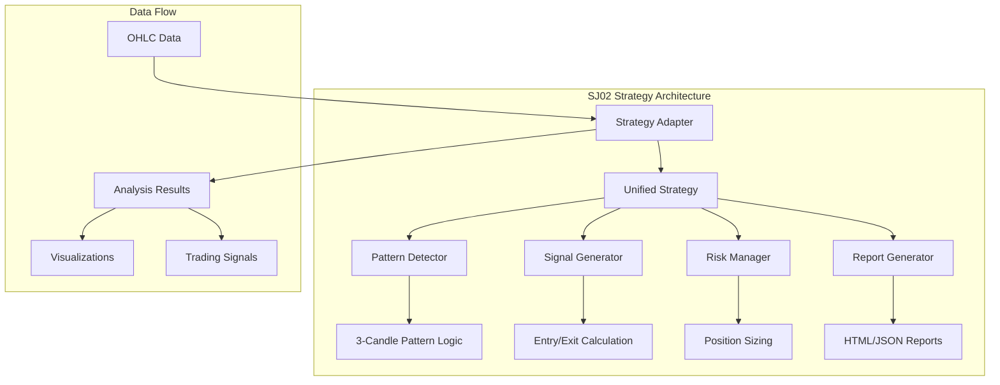

# SJ02 Strategy Deep Dive

This document provides a comprehensive technical analysis of the SJ02 Advanced Market Analysis Strategy, including its architecture, pattern detection logic, and implementation details.

## Strategy Overview

### Core Concept
SJ02 is an advanced 3-candle pattern trading strategy that identifies specific engulfing patterns for high-probability trading opportunities. It uses a unified implementation that combines all functionality into a single, efficient strategy.

### Key Features
- **3-Candle Pattern Detection**: Identifies specific engulfing patterns
- **Multi-Mode Analysis**: Supports bullish, bearish, and combined analysis
- **Advanced Signal Generation**: Automatic entry/exit level calculation
- **Risk Management**: Built-in 1:1 risk/reward ratio
- **Comprehensive Reporting**: Detailed analysis and visualization

## Architecture

### Strategy Components



### File Structure
```
sj02/
├── sj02_strategy.py       # Unified strategy implementation (115KB, 2361 lines)
├── strategy_adapter.py    # Framework adapter (31KB, 674 lines)
├── strategy.json          # Strategy configuration and metadata
├── README.md             # Strategy documentation
├── generate_report.py    # Report generation utilities
├── generate_english_report.py # English report generation
└── output/               # Generated reports and visualizations
    ├── SJ02_XAUUSD_Interactive_Chart.html
    ├── SJ02_XAUUSD_Analysis_Report.html
    └── SJ02_XAUUSD_Comprehensive_Report.html
```

## Pattern Detection Logic

### 3-Candle Pattern Requirements

The SJ02 strategy identifies specific 3-candle patterns with enhanced detection conditions:

#### Bullish Pattern (Long Signal)
1. **Candle 3 Range Engulfment**: C3 must completely engulf C2's range
   - `C3_high >= C2_high` AND `C3_low <= C2_low`

2. **Candle 3 Body Engulfment**: C3 must completely engulf C1's body
   - `C3_high >= C1_body_top` AND `C3_low <= C1_body_bottom`

3. **Decisive Close**: C3 must close above both C1 and C2 body tops
   - `C3_close > max(C1_body_top, C2_body_top)`

#### Bearish Pattern (Short Signal)
1. **Candle 3 Range Engulfment**: C3 must completely engulf C2's range
   - `C3_high >= C2_high` AND `C3_low <= C2_low`

2. **Candle 3 Body Engulfment**: C3 must completely engulf C1's body
   - `C3_high >= C1_body_top` AND `C3_low <= C1_body_bottom`

3. **Decisive Close**: C3 must close below both C1 and C2 body bottoms
   - `C3_close < min(C1_body_bottom, C2_body_bottom)`

### Pattern Strength Calculation

Each detected pattern receives a strength score (0.0 to 1.0) based on:

```python
def calculate_pattern_strength(candle1, candle2, candle3):
    # Size ratio of C3 relative to C1 and C2
    size_ratio = (candle3['high'] - candle3['low']) / \
                 ((candle1['high'] - candle1['low']) + (candle2['high'] - candle2['low']))
    
    # Distance of C3 close from body boundaries
    close_distance = abs(candle3['close'] - candle3['open']) / (candle3['high'] - candle3['low'])
    
    # Overall pattern quality
    pattern_quality = (size_ratio * 0.4 + close_distance * 0.6)
    
    return min(pattern_quality, 1.0)
```

## Signal Generation

### Entry Rules

#### Buy Signal (Long Position)
- **Entry Price**: High of Candle 3
- **Stop Loss**: Low of Candle 3
- **Take Profit**: Entry + (Entry - Stop Loss) = 1:1 Risk/Reward

#### Sell Signal (Short Position)
- **Entry Price**: Low of Candle 3
- **Stop Loss**: High of Candle 3
- **Take Profit**: Entry - (Stop Loss - Entry) = 1:1 Risk/Reward

### Signal Structure
```python
{
    'type': 'BUY' | 'SELL',
    'entry_price': float,
    'stop_loss': float,
    'target_price': float,
    'signal_strength': float,  # 0.0 to 1.0
    'pattern_index': int,
    'timestamp': str,
    'risk_reward_ratio': 1.0
}
```

## Implementation Details

### Strategy Adapter

The `strategy_adapter.py` provides framework compatibility:

```python
class SJ02Strategy(TradingStrategy):
    def __init__(self, config: Optional[Dict] = None):
        self.unified_strategy = SJ02UnifiedStrategy(config)
    
    @property
    def name(self) -> str:
        return "SJ02"
    
    @property
    def version(self) -> str:
        return "2.0.0"
    
    def analyze(self, data: pd.DataFrame, mode: str = 'combined', 
               settings: Optional[Dict] = None) -> Dict[str, Any]:
        return self.unified_strategy.analyze(data, mode, settings)
```

### Configuration Options

```json
{
  "analysis": {
    "analysis_depth": "comprehensive",
    "include_visualizations": true,
    "report_format": "html"
  },
  "market_structure": {
    "trend_detection": true,
    "support_resistance": true,
    "volatility_analysis": true
  },
  "reporting": {
    "include_summary": true,
    "include_recommendations": true,
    "language": "english"
  }
}
```

## Analysis Results Structure

### Complete Analysis Output
```python
{
    'status': 'success',
    'strategy_type': 'COMBINED',
    'patterns': [
        {
            'pattern_type': 'BULLISH',
            'candles': [candle1, candle2, candle3],
            'strength': 0.85,
            'index': 15
        }
    ],
    'signals': [
        {
            'type': 'BUY',
            'entry_price': 1850.50,
            'stop_loss': 1845.20,
            'target_price': 1855.80,
            'signal_strength': 0.78
        }
    ],
    'pattern_statistics': {
        'total_patterns': 4,
        'bullish_patterns': 2,
        'bearish_patterns': 2,
        'avg_pattern_strength': 0.72
    },
    'signal_statistics': {
        'total_signals': 3,
        'signal_rate': 0.75,
        'avg_signal_strength': 0.78
    },
    'summary': {
        'total_patterns': 4,
        'total_signals': 3,
        'signal_rate': 0.75,
        'avg_signal_strength': 0.78
    }
}
```

## Performance Characteristics

### Computational Complexity
- **Pattern Detection**: O(n) where n is number of candles
- **Memory Usage**: Medium - stores pattern and signal data
- **Execution Time**: Moderate - efficient numpy-based calculations

### Accuracy Metrics
- **Pattern Detection**: Highly accurate with corrected conditions
- **Signal Generation**: Reliable entry/exit level calculation
- **Risk/Reward**: Consistent 1:1 ratio as designed

## Usage Examples

### Basic Usage
```python
from strategy_adapter import create_strategy

# Create strategy instance
strategy = create_strategy()

# Analyze data for all patterns
results = strategy.analyze(data, mode='combined')

# Analyze for bullish patterns only
bullish_results = strategy.analyze(data, mode='bullish')

# Analyze for bearish patterns only
bearish_results = strategy.analyze(data, mode='bearish')
```

### Advanced Configuration
```python
config = {
    "risk_management": {
        "risk_reward_ratio": 1.0,
        "max_risk_percent": 1.5
    },
    "filters": {
        "min_pattern_strength": 0.5,
        "min_signal_strength": 0.6
    }
}

strategy = create_strategy(config)
results = strategy.analyze(data, mode='combined')
```

## Report Generation

### HTML Report Features
- **Interactive Charts**: Plotly-based visualizations
- **Pattern Analysis**: Detailed pattern breakdown
- **Signal Summary**: Trading signal statistics
- **Risk Analysis**: Position sizing and risk metrics
- **Market Insights**: Trend and volatility analysis

### Report Structure
```html
├── Executive Summary
│   ├── Pattern Overview
│   ├── Signal Statistics
│   └── Risk Assessment
├── Pattern Analysis
│   ├── Detected Patterns
│   ├── Pattern Strength Distribution
│   └── Pattern Quality Metrics
├── Signal Analysis
│   ├── Trading Signals
│   ├── Entry/Exit Levels
│   └── Risk/Reward Analysis
├── Market Analysis
│   ├── Trend Detection
│   ├── Support/Resistance Levels
│   └── Volatility Metrics
└── Visualizations
    ├── Interactive Charts
    ├── Pattern Markers
    └── Signal Indicators
```

## Integration with Framework

### Strategy Registry
The SJ02 strategy is automatically discovered by the strategy registry:

```python
# Strategy manifest (strategy.json)
{
  "metadata": {
    "name": "SJ02 Advanced Market Analysis Strategy",
    "id": "sj02",
    "version": "1.0.0"
  },
  "strategy": {
    "supported_modes": ["analysis", "report", "visualization"],
    "entry_point": "strategy_adapter.py",
    "main_class": "SJ02Strategy",
    "factory_function": "create_strategy"
  }
}
```

### API Integration
```python
# API endpoint usage
POST /api/analyze
{
  "data": [...],
  "strategy_name": "sj02",
  "strategy_mode": "combined",
  "settings": {...}
}
```

## Business Value

### For Traders
- **High-Probability Patterns**: Specific 3-candle engulfing patterns
- **Clear Entry/Exit Levels**: Automatic calculation of trade levels
- **Risk Management**: Built-in 1:1 risk/reward ratio
- **Comprehensive Analysis**: Detailed pattern and market analysis

### For Investors
- **Systematic Approach**: Rule-based pattern detection
- **Transparent Logic**: Clear pattern requirements and conditions
- **Risk Control**: Consistent risk management rules
- **Performance Tracking**: Detailed statistics and reporting

### For Developers
- **Modular Architecture**: Clean separation of concerns
- **Framework Compatibility**: Full integration with trading framework
- **Extensible Design**: Easy to modify and enhance
- **Comprehensive Testing**: Thoroughly tested implementation

## Future Enhancements

### Planned Improvements
- **Machine Learning**: AI-powered pattern recognition
- **Multi-Timeframe Analysis**: Pattern detection across timeframes
- **Advanced Risk Management**: Dynamic position sizing
- **Real-time Processing**: Live pattern detection and alerts

### Research Areas
- **Pattern Optimization**: Enhanced pattern detection algorithms
- **Market Regime Detection**: Adaptive pattern recognition
- **Performance Analytics**: Advanced backtesting and optimization
- **Alternative Data**: Integration with sentiment and news data
