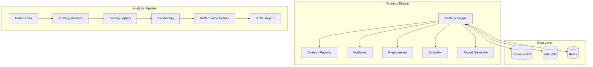

# Strategy Analysis Deep Dive

This document provides a comprehensive technical overview of how trading strategies are analyzed, backtested, and evaluated in the platform.

## Strategy Analysis Architecture

### Core Components



## Strategy Analysis Process

### 1. Data Preprocessing

The platform processes market data through several validation and preprocessing steps:

- **Format Validation**: Ensures OHLC data structure integrity
- **Data Cleaning**: Removes outliers and fills missing values
- **Indicator Calculation**: Adds technical indicators (RSI, moving averages, etc.)
- **Time Series Validation**: Ensures chronological order and consistency

### 2. Strategy Execution

Each strategy implements the `TradingStrategy` interface:

```python
class TradingStrategy(ABC):
    @property
    def name(self) -> str: pass
    
    @property
    def supported_modes(self) -> List[str]: pass
    
    def analyze(self, data: pd.DataFrame, mode: str, 
               settings: Optional[Dict] = None) -> Dict[str, Any]: pass
    
    def validate_data(self, data: pd.DataFrame) -> List[str]: pass
```

### 3. Signal Generation

Strategies generate trading signals based on:

- **Entry Conditions**: Price levels, technical indicators, patterns
- **Exit Conditions**: Take profit, stop loss, time-based exits
- **Position Sizing**: Risk-based position calculation
- **Risk Management**: Maximum drawdown limits, correlation checks

## Available Strategies

### SJ01 - Order Block Strategy

**Purpose**: Identifies institutional order blocks using price action and volume analysis

**Key Features**:
- Swing high/low detection with market structure validation
- Marubozu pattern recognition (strong directional candles)
- Order block strength calculation based on multiple factors
- Volume confirmation for signal validation

**Analysis Modes**:
- `bullish`: Long position opportunities
- `bearish`: Short position opportunities
- `combined`: Both long and short signals

**Strength Calculation**:
```python
strength = (
    price_change_score * 0.3 +
    consistency_score * 0.25 +
    volume_score * 0.25 +
    body_ratio * 0.2
)
```

### SJ02 - Pattern Trading Strategy

**Purpose**: Identifies 3-candle patterns for trend continuation/reversal

**Key Features**:
- Multi-timeframe pattern analysis
- Pattern strength scoring
- Risk-reward ratio optimization
- Comprehensive pattern statistics

### MF01 - Multi-Factor Strategy

**Purpose**: Combines multiple technical indicators for robust signal generation

**Key Features**:
- RSI divergence detection
- Moving average crossovers
- ATR-based volatility analysis
- Fibonacci retracement levels
- Risk management integration

## Backtesting Engine

### Simulation Components


### Trade Simulation

The backtesting engine simulates realistic trading conditions:

- **Slippage**: Models market impact and execution delays
- **Spread**: Includes bid-ask spread costs
- **Commission**: Applies realistic trading fees
- **Position Sizing**: Implements risk-based position management

### Risk Management

- **Per-Trade Risk**: Configurable percentage of capital at risk
- **Maximum Drawdown**: Hard limits on portfolio decline
- **Correlation Limits**: Prevents over-concentration in similar assets
- **Position Limits**: Maximum position size constraints

## Performance Metrics

### Key Performance Indicators

| Metric | Description | Formula | Target |
|--------|-------------|---------|---------|
| **Total Return** | Overall portfolio performance | (Final - Initial) / Initial | > Market Benchmark |
| **Win Rate** | Percentage of profitable trades | Winning Trades / Total Trades | > 50% |
| **Profit Factor** | Ratio of gross profits to gross losses | Gross Profits / Gross Losses | > 1.5 |
| **Sharpe Ratio** | Risk-adjusted returns | (Return - Risk Free) / Std Dev | > 1.0 |
| **Max Drawdown** | Largest peak-to-trough decline | Max((Peak - Current) / Peak) | < 20% |
| **Calmar Ratio** | Return relative to maximum drawdown | Annual Return / Max Drawdown | > 1.0 |

### Advanced Metrics

- **Sortino Ratio**: Downside deviation-based risk adjustment
- **Information Ratio**: Active return relative to tracking error
- **Omega Ratio**: Probability-weighted return distribution
- **Ulcer Index**: Drawdown-based risk measurement

## Report Generation

### HTML Report Structure

```html
├── Executive Summary
│   ├── Performance Overview
│   ├── Key Metrics
│   └── Risk Assessment
├── Trade Analysis
│   ├── Trade List
│   ├── Entry/Exit Analysis
│   └── Risk Management
├── Performance Charts
│   ├── Equity Curve
│   ├── Drawdown Chart
│   └── Monthly Returns
└── Technical Details
    ├── Strategy Parameters
    ├── Data Quality
    └── System Performance
```

### Report Features

- **Interactive Charts**: Zoom, pan, and hover details
- **Export Options**: PDF, Excel, CSV formats
- **Customizable Views**: Time periods, metrics focus
- **Comparative Analysis**: Multiple strategy comparison

## Data Quality & Validation

### Market Data Requirements

- **Minimum Records**: 100+ OHLC candles for reliable analysis
- **Time Consistency**: Regular intervals (1m, 5m, 15m, 1h, 1d)
- **Volume Data**: Required for volume-based strategies
- **Data Freshness**: Real-time or near-real-time updates

### Validation Checks

- **OHLC Logic**: High ≥ Open/Close ≥ Low
- **Price Continuity**: No extreme price jumps
- **Volume Consistency**: Reasonable volume patterns
- **Time Gaps**: Maximum allowed gaps between records

## Performance Optimization

### Caching Strategy

- **Strategy Instances**: Cached after first load
- **Configuration**: Parameter caching for repeated calls
- **Results**: Analysis result caching with TTL
- **Database**: Query result caching for common requests

### Scalability Features

- **Async Processing**: Non-blocking operations for large datasets
- **Batch Processing**: Efficient DataFrame operations
- **Memory Management**: Optimized data structures
- **Load Balancing**: Horizontal scaling support

## Integration & Extensibility

### API Endpoints

```python
# Core Analysis
POST /api/analyze          # Strategy analysis
GET  /api/strategies       # Available strategies
GET  /api/strategies/{id}  # Strategy details

# Backtesting
POST /api/backtest         # Run backtest
GET  /api/backtest/{id}    # Backtest results
GET  /api/backtest/{id}/report  # Download report

# Performance
GET  /api/performance      # Performance metrics
GET  /api/metrics          # System metrics
```

### External Integration

- **Webhook Support**: Real-time result notifications
- **REST API**: Standard HTTP interface
- **WebSocket**: Real-time data streaming
- **SDK Support**: Python client libraries

## Monitoring & Observability

### System Metrics

- **API Response Times**: Endpoint performance tracking
- **Strategy Execution**: Analysis duration and success rates
- **Database Performance**: Query times and connection health
- **Resource Usage**: CPU, memory, and disk utilization

### Alerting

- **Performance Degradation**: Response time thresholds
- **Error Rates**: Failed analysis attempts
- **Resource Limits**: Memory and CPU usage alerts
- **Data Quality**: Validation failure notifications

## Future Enhancements

### Planned Features

- **Machine Learning**: AI-powered signal generation
- **Portfolio Optimization**: Multi-asset allocation
- **Real-time Trading**: Live execution capabilities
- **Advanced Analytics**: Sentiment analysis, news integration

### Research Areas

- **Alternative Data**: Social media, news sentiment
- **Market Microstructure**: Order flow analysis
- **Regime Detection**: Market condition identification
- **Parameter Optimization**: Automated strategy tuning

## Investment Considerations

### Risk Factors

- **Backtesting Limitations**: Historical performance doesn't guarantee future results
- **Market Conditions**: Strategy performance varies with market regimes
- **Data Quality**: Results depend on accurate and timely market data
- **Execution Risk**: Real-world trading may differ from simulations

### Due Diligence

- **Strategy Validation**: Understand underlying logic and assumptions
- **Risk Management**: Evaluate position sizing and drawdown controls
- **Performance History**: Review backtest results across different market conditions
- **Technology Stack**: Assess system reliability and scalability

### Competitive Advantages

- **Modular Architecture**: Easy strategy addition and modification
- **Comprehensive Validation**: Multi-layer data and strategy validation
- **Professional Reporting**: Institutional-grade analysis and documentation
- **Scalable Infrastructure**: Production-ready deployment and monitoring
